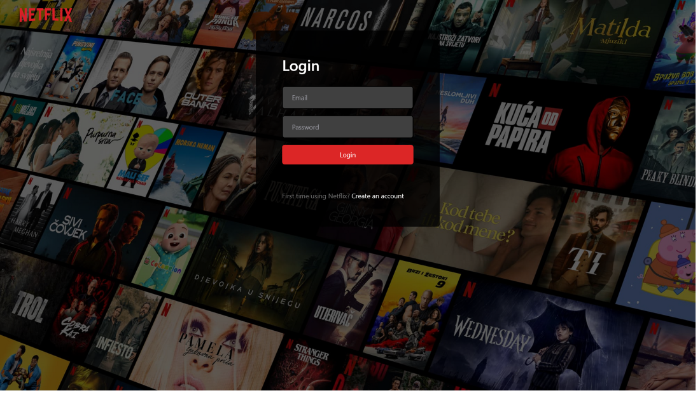

# Netflix Clone - Nextjs v13.4

This is a full-stack practical **Netflix Clone** using [Next.js](https://nextjs.org/) latest features bootstrapped with [`create-next-app`](https://github.com/vercel/next.js/tree/canary/packages/create-next-app).

Explore the [demo](https://maxjn-netflix-clone.vercel.app/) for better understanding'.

## Technologies

- TSX, Tailwindcss,
- TypeScript
- **Nextjs v13.4.1**
- **Main Packages:** mongodb, mongoose, next-auth, prisma ,redux-toolkit, react-reudux, jest
- **Secondary Packages:** react-icons, bcrypt
- **Routing:** useing new app directory

## Features

- Environment, Typescript, NextJS Setup
- MongoDB & Prisma connect, Database creation
- **Authentication** using NextAuth, (Google, Github & Credentials)
- Full responsiveness on all devices
- API creation
- Detail-oriented effects and animations using TailwindCSS
- **Server-side** data fetching
- **Redux** state management for managing modal state
- **Jest & RTL** test

## Installation

###### Add Environment Variables

Create **.env.local** from '.env.example' file and declare the project environment variables

Starting a development instance of the app

###### shell command

```shell
npm install

npx prisma push

npm run dev
```

###### test command

```shell
npm run test

npm run coverage
```

###### deployment command on vercel

```shell
npm run vercel-build
```

## Screenshots


